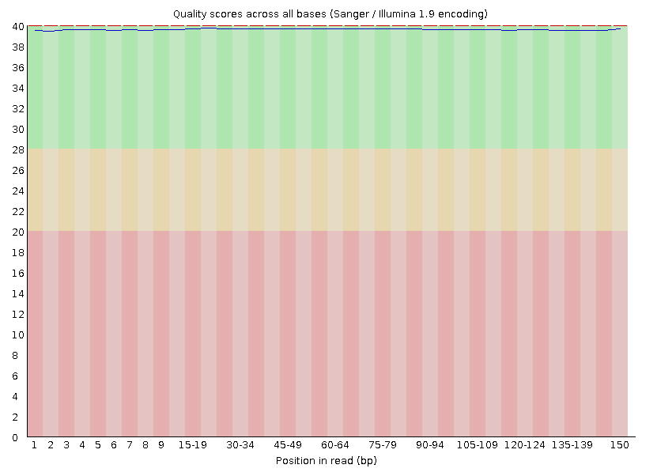
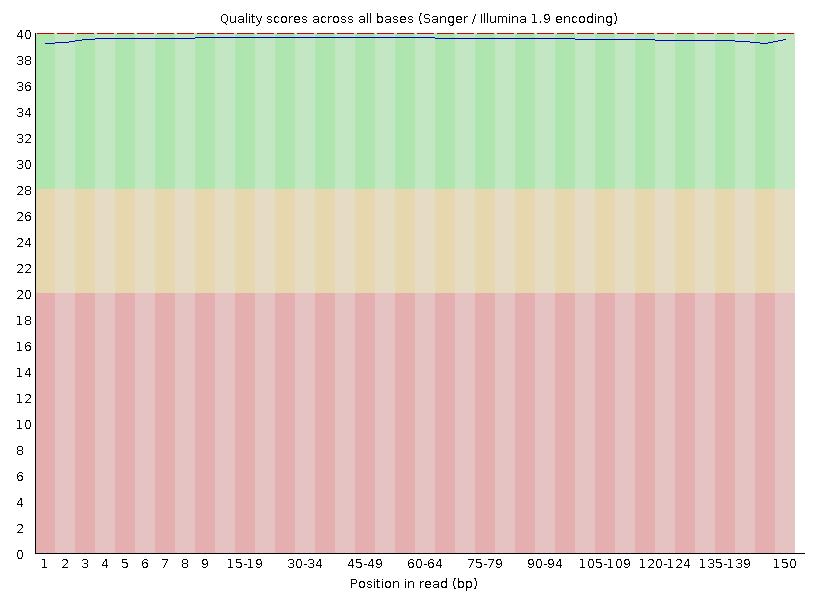
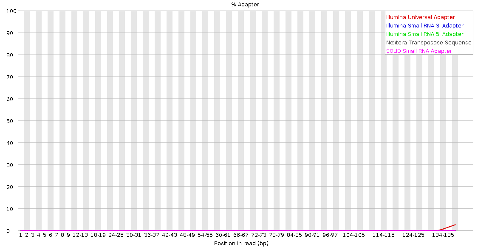
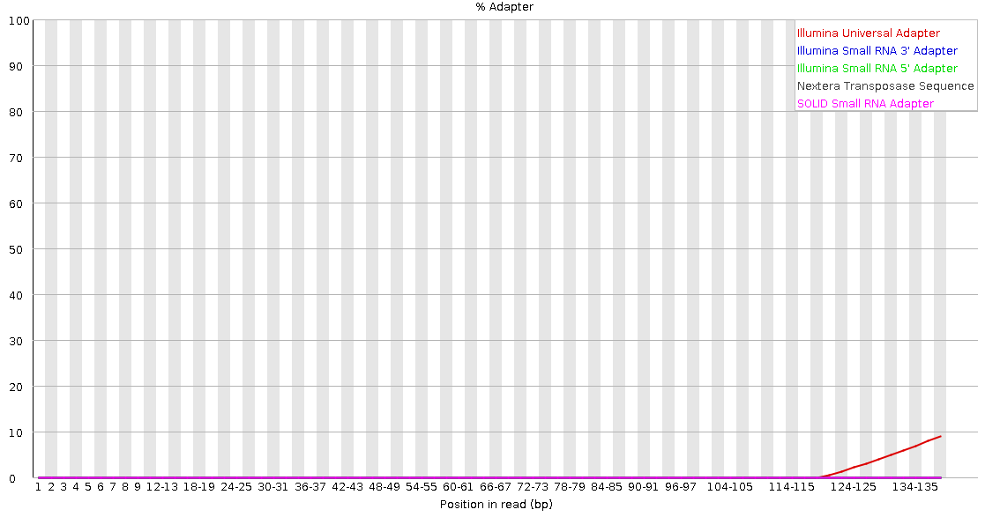

# Assembling and analyzing a Pr88168 genome

1. Retrieve sequence reads for project.
```bash
   scp ngs lab for my genome
```
## First I need to assess the quality and trim of the sequence data I am working with

1. Initial count of the total number of sequence reads in the raw read data
```bash
   awk 'NR % 4 == 2 {s++} END {print s}' Pr88168_1.fq
```
This gave me a total of 9,078,004 raw reads (single end)

2. Assess sequence quality of raw read data using FASTQC
```bash
   fastqc Pr88168_1.fq.gz Pr88168_2.fq.gz
```
## Quality score for raw forward and reverse reads
<p float="middle">
   
   
</p>

## Adaptor content for raw forward and reverse reads
<p float="middle">
   
   
</p>

These graphs show I am working with a fairly high quality sequence but there is a high amount of adaptor content towards the end that needs to be trimmed

3. Retrieve the adaptor file needed to trim adaptor content from the sequence
```bash
   scp ngs lab for adaptors.fasta
```
4. Now I can trim the reads using trimmomatic to address the high adapter content
```bash
   java -jar trimmomatic-0.38.jar PE -threads 2 -phred33 -trimlog Pr88168_errorlog.txt
   Pr88168_1.fq.gz
   Pr88168_2.fq.gz
   Pr88168_1_paired.fq
   Pr88168_1_unpaired.fq
   Pr88168_2_paired.fq
   Pr88168_2_unpaired.fq
   ILLUMINACLIP:adaptors.fa:2:30:10 SLIDINGWINDOW:20:20 MINLEN:100
```
5. Next I will assess the sequence quality of the trimmed paired reads using FASTQC
```bash
   fastqc Pr88168_paired_1.fq.gz Pr88168_paired_2.fq.gz
```
## Quality score for trimmed forward and reverse reads
<p float="middle">
   
   
</p>

## Adaptor content for trimmed forward and reverse reads
<p float="middle">
   
   
</p>

Comparing these results from our previous FASTQC of the raw reads we can see a significant decrease in adpator content in the forward and reverse reads which also improves the quality of the overall sequence

6. Finally, I will transfer the trimmed Pr88168 paired reads to the Morgan Compute Cluster for more intensive operations
```bash
   scp jrhu252@jrhu252.cs.uky.edu:MyGenome/Pr88168_paired_1.fq.gz .(MCC/jrhu252 Directory)
   scp jrhu252@jrhu252.cs.uky.edu:MyGenome/Pr88168_paired_2.fq.gz .(MCC/jrhu252 Directory)
```
## Now with the sequence properly trimmed and in the right place I can assemble the genome

1. First, I assemble the genome using Velvet or more specifically VelvetOptimiser which automates the tedious task of trying to find the most accurate k-mer value possible. 

```bash
   sbatch velvetoptimiser_noclean.sh Pr88168 89 109 2
```
This gave me an optimal k-mer value of 97 and more importantly an assembled genome

2. Next, I want to rename the sequence headers to be more easily understood and remove sequences that are < 200 nt in length

Luckily, my professor provided two perl scrips to make this process much easier for us:
```bash
   perl SimpleFastaHeaders.pl  Pr88168.fasta Pr88168
   perl CullShortContigs.pl Pr88168_nh.fasta
   perl SeqLen.pl Pr88168_final.fasta
```

3. Finally, I will use BUSCO to check for genome-completeness and see how well of an assembly we have made

```bash
   sbatch /project/farman_s25abt480/SLURM_SCRIPTS/BuscoSingularity.sh Pr88168_final.fasta
```
This gave me a BUSCO score of 98.4% and 98.8% if including fragmentation with the complete portion


